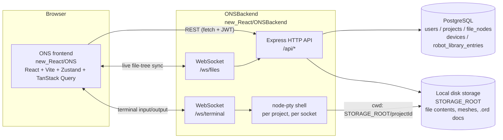
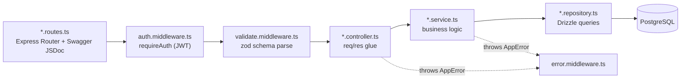
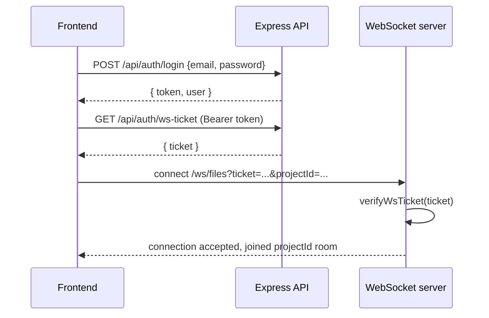
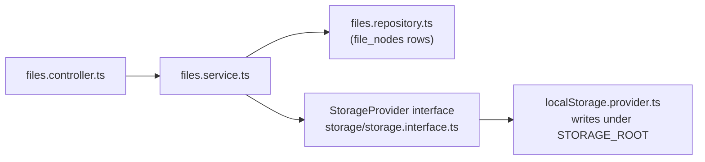
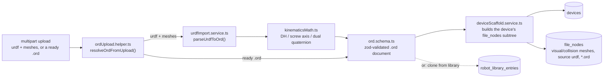
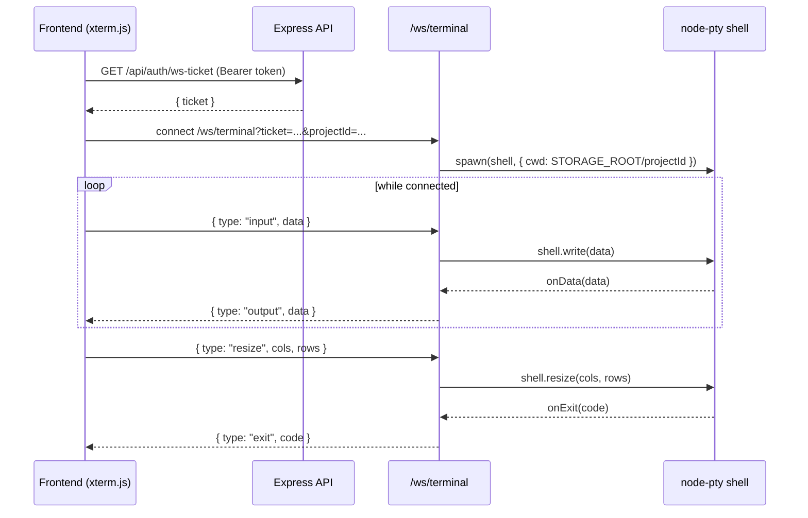
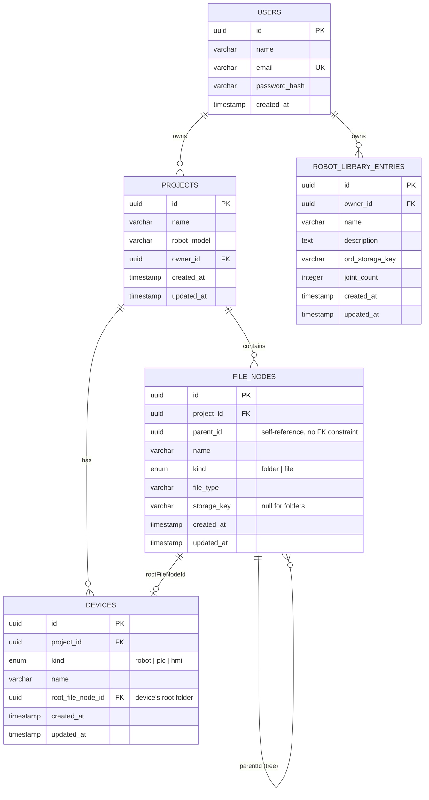
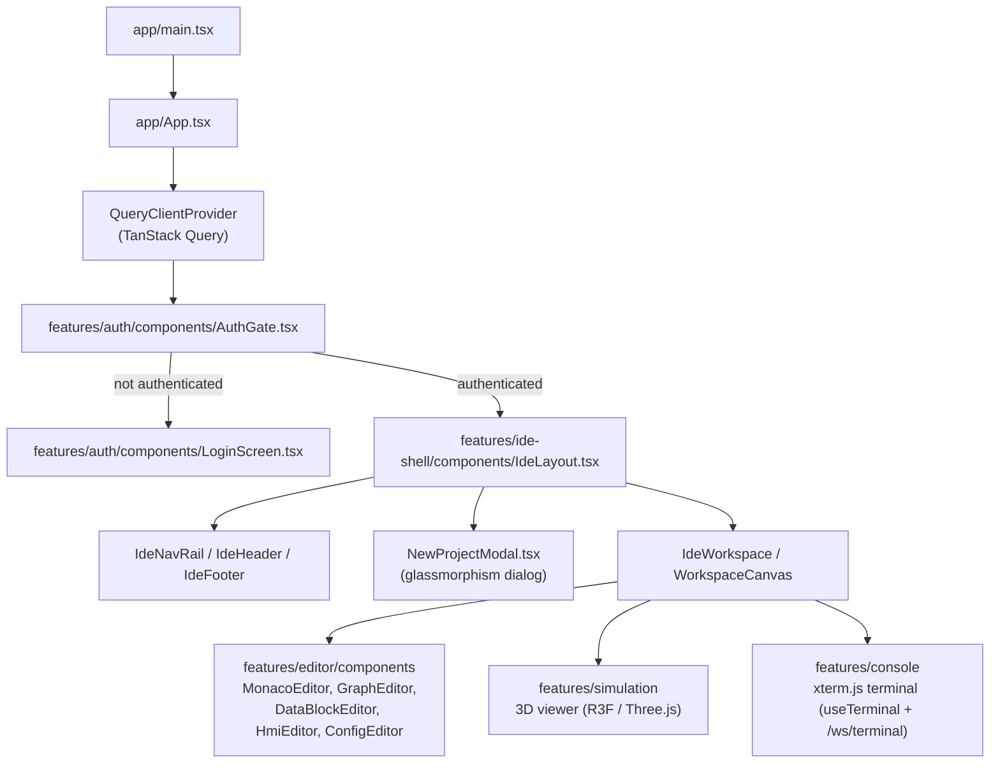
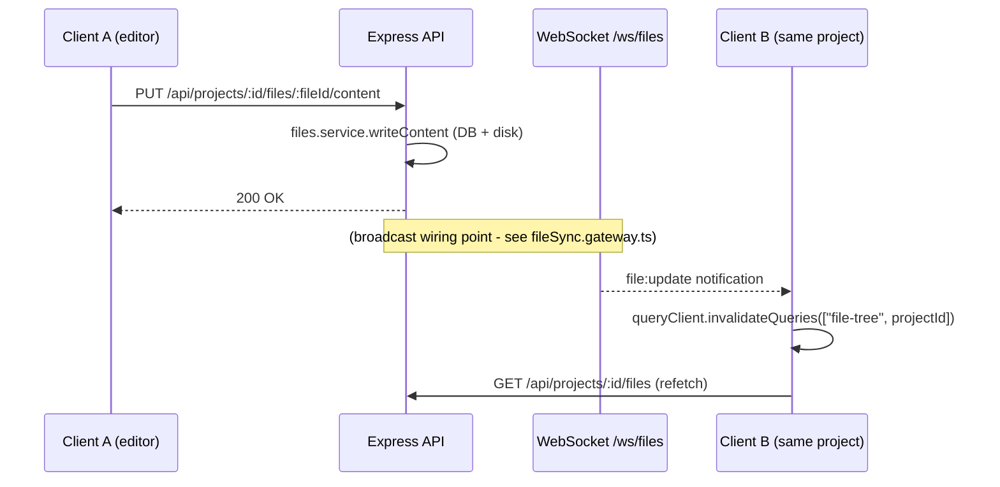
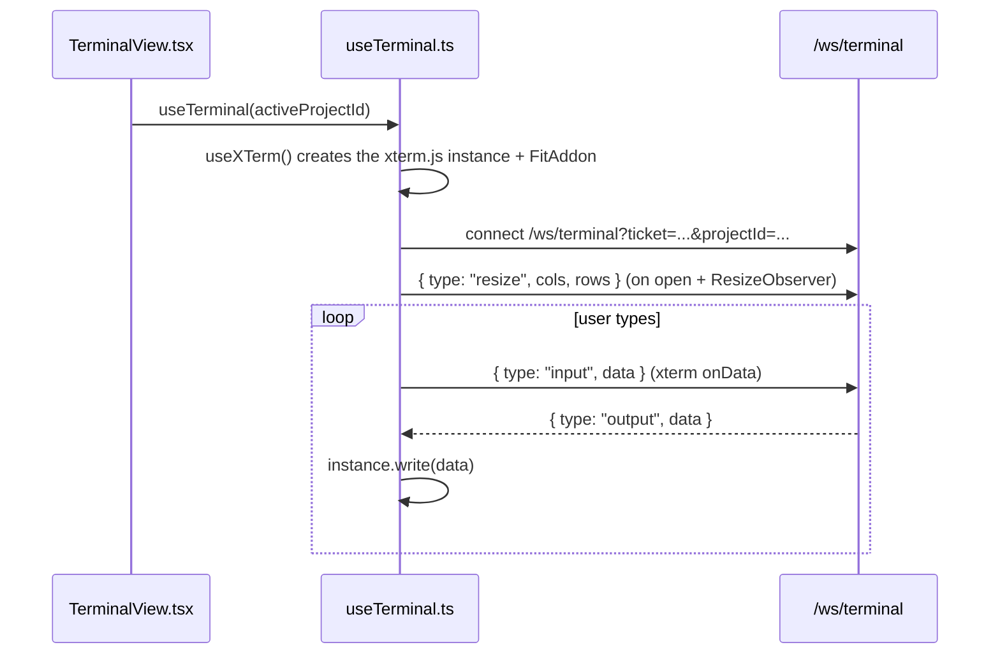

# Architecture & Contributor Guide

This document explains how the ONS frontend, backend, and database fit
together so new contributors can find the right place to add or modify code.
For setup/run instructions, see the root [README.md](../README.md).

## 1. System Overview

- **Metadata** (users, projects, folder/file names and tree structure,
  robot/PLC/HMI devices, reusable robot-library entries) lives in
  **PostgreSQL**, accessed through Drizzle ORM.
- **File contents** (text files, uploaded meshes, derived `.ord` robot
  descriptions) live on **local disk**, behind a small storage interface so
  the backing store can be swapped later.
- The **file-sync WebSocket** (`/ws/files`) only carries change notifications
  (create/update/delete/rename); clients react by invalidating and refetching
  data over REST, not by receiving payloads over the socket.
- The **terminal WebSocket** (`/ws/terminal`) is different: it's a live,
  bidirectional byte stream to a real shell process (`node-pty`), not a
  notification channel — see [2.6](#26-terminal-sessions).

## 2. Backend (`new_React/ONSBackend`)

### 2.1 Request lifecycle

Every module (`auth`, `projects`, `files`, `devices`, `robots`) follows the
same layering:

- [app.ts](../new_React/ONSBackend/src/app.ts) wires up Helmet, CORS, JSON
  body parsing, request logging (`pino-http`), rate limiting on `/api/auth`,
  the three route groups, Swagger UI (`/api-docs`), and the error middleware
  last.
- [server.ts](../new_React/ONSBackend/src/server.ts) creates the HTTP server
  from `createApp()` and attaches the WebSocket server to the same server
  instance.
- Errors are plain classes in
  [errors/AppError.ts](../new_React/ONSBackend/src/errors/AppError.ts)
  (`ValidationError`, `UnauthorizedError`, `NotFoundError`, `ConflictError`).
  Throw one of these anywhere in a controller/service and
  [error.middleware.ts](../new_React/ONSBackend/src/middlewares/error.middleware.ts)
  turns it into the right HTTP status + JSON body.
- Request validation is declarative:
  `validate({ body, params, query })` in
  [validate.middleware.ts](../new_React/ONSBackend/src/middlewares/validate.middleware.ts)
  runs the corresponding zod schema from each module's `*.validators.ts` file
  and replaces `req.body`/`req.params`/`req.query` with the parsed result.

### 2.2 Modules

| Module | Routes file | Responsibility |
| --- | --- | --- |
| `auth` | [modules/auth/auth.routes.ts](../new_React/ONSBackend/src/modules/auth/auth.routes.ts) | Signup, login, WS ticket issuance |
| `projects` | [modules/projects/projects.routes.ts](../new_React/ONSBackend/src/modules/projects/projects.routes.ts) | Project CRUD, scoped to the authenticated owner |
| `files` | [modules/files/files.routes.ts](../new_React/ONSBackend/src/modules/files/files.routes.ts) | File-tree CRUD and file content read/write, mounted under `/api/projects/:projectId/files` |
| `devices` | [modules/devices/devices.routes.ts](../new_React/ONSBackend/src/modules/devices/devices.routes.ts) | Add/list/remove a project's robot/PLC/HMI devices; scaffolds each device's folder subtree, mounted under `/api/projects/:projectId/devices` |
| `robots` | [modules/robots/robotLibrary.routes.ts](../new_React/ONSBackend/src/modules/robots/robotLibrary.routes.ts) | `.ord` schema, URDF import/derivation, and the reusable robot library (`/api/robot-library`) |

All routes except signup/login require `requireAuth`
([middlewares/auth.middleware.ts](../new_React/ONSBackend/src/middlewares/auth.middleware.ts)),
which verifies the `Authorization: Bearer <jwt>` header and attaches the
decoded payload to `req.user`.

### 2.3 Auth and WebSocket handshake

The JWT used for REST calls is never sent to the WebSocket endpoint directly;
it's exchanged for a short-lived, single-purpose ticket
([utils/jwt.ts](../new_React/ONSBackend/src/utils/jwt.ts)) first.
[ws/wsServer.ts](../new_React/ONSBackend/src/ws/wsServer.ts) handles upgrades
for **both** `/ws/files` and `/ws/terminal` (multiplexed by request path onto
two separate `WebSocketServer` instances), verifying the same ticket either
way. For `/ws/files`, the socket joins a per-project room via
[ws/connectionRegistry.ts](../new_React/ONSBackend/src/ws/connectionRegistry.ts), and
[ws/fileSync.gateway.ts](../new_React/ONSBackend/src/ws/fileSync.gateway.ts)
defines the notification message shape (`file:create` / `file:update` /
`file:delete` / `file:rename`). `/ws/terminal` instead hands the socket to
[ws/terminal.gateway.ts](../new_React/ONSBackend/src/ws/terminal.gateway.ts) — see
[2.6](#26-terminal-sessions).

### 2.4 File content storage

`file_nodes` rows hold metadata and a `storageKey`; the actual bytes are
written/read through the
[StorageProvider interface](../new_React/ONSBackend/src/storage/storage.interface.ts),
currently implemented by
[localStorage.provider.ts](../new_React/ONSBackend/src/storage/localStorage.provider.ts).
To swap in a different backing store (e.g. S3), implement the same interface
and change what `files.service.ts` imports — no route/controller changes
needed.

### 2.5 Robot descriptions (`.ord`) and devices

- **`.ord`** (ONS Robot Description) is a JSON document — not a hand-authored
  alternative to URDF, but a derived superset of it: it keeps a reference to
  the original URDF/SDF source file plus mesh references, and adds DH
  parameters, screw axes (Lynch & Park space-frame convention), and a
  dual-quaternion base pose, computed once at import time so nothing
  downstream (simulation, controller codegen) has to re-derive them. Field
  names are ONS's own, not USD/SDF-compatible by design — see the format
  discussion for the full rationale.
- [kinematicsMath.ts](../new_React/ONSBackend/src/modules/robots/kinematicsMath.ts)
  is pure vector/matrix math (no I/O), unit-tested in
  [tests/kinematicsMath.test.ts](../new_React/ONSBackend/tests/kinematicsMath.test.ts).
  DH derivation uses the common-normal construction along the **longest
  root-to-leaf joint chain** — branch joints (e.g. a gripper fork) still get a
  screw axis but no DH parameters. Only revolute/continuous/prismatic/fixed
  joints are supported.
- [urdfImport.service.ts](../new_React/ONSBackend/src/modules/robots/urdfImport.service.ts)
  parses URDF XML (`fast-xml-parser`) into an `.ord` document, verified
  end-to-end against the real UR5 sample in
  [tests/urdfImport.test.ts](../new_React/ONSBackend/tests/urdfImport.test.ts).
  SDF import is not implemented yet.
- A **device** (`devices` table) is a robot/PLC/HMI attached to a project;
  `rootFileNodeId` points at its root folder in `file_nodes` so other code can
  find "the robot" without walking the whole tree. v1 allows at most one
  device per kind per project (`devices_project_id_kind_unique`).
- [deviceScaffoldService](../new_React/ONSBackend/src/modules/devices/deviceScaffold.service.ts)
  creates the folder subtree per kind (Kinematic Chain / Visual Model /
  Collision Model / Simulation / Hardware Config / Software Config / Programs
  / Safety Programs for a robot; the PLC/HMI equivalents), matching
  [mockTreeData.json](../new_React/ONS/src/mocks/mockTreeData.json)'s shape.
  Robot devices additionally get their meshes, source URDF, and `.ord` file
  attached as real `file_nodes` under that subtree.
- The **robot library** (`robot_library_entries`) is a reusable, project-independent
  catalog: create an entry once (upload or derive an `.ord`), then any project
  can add a robot device by cloning it (`devices.service.ts`'s
  `relocateOrdFiles` copies the referenced mesh/source bytes into the new
  project's own storage, so a project stays intact even if the library entry
  is later edited or removed).

### 2.6 Terminal sessions

Unlike `/ws/files`, this socket is a live byte stream, not a notification
channel: [ws/terminal.gateway.ts](../new_React/ONSBackend/src/ws/terminal.gateway.ts)
spawns one real shell process (`node-pty`) per socket connection, `cwd`'d into
that project's storage directory, and kills it when the socket closes. There
is no reconnect/replay of scrollback — closing the terminal ends the shell.

## 3. Database schema

Schemas live in
[db/schema/*.schema.ts](../new_React/ONSBackend/src/db/schema/) (one file per
table) and are the source of truth for migrations. After editing a schema
file, run `npm run db:generate` then `npm run db:migrate` (see the
[Database section of the README](../README.md#database)). `file_nodes.parentId`
is intentionally left without a foreign-key constraint to avoid Drizzle's
circular-reference workaround; ordering/validity is enforced in
[files.repository.ts](../new_React/ONSBackend/src/modules/files/files.repository.ts)
instead. `devices` has a unique constraint on `(project_id, kind)` for v1 (see
[2.5](#25-robot-descriptions-ord-and-devices)); `projects.robot_model` predates the
`devices` table and is unused by new code.

## 4. Frontend (`new_React/ONS`)

### 4.1 App shell

`AuthGate` reads `useAuthStore` and renders `LoginScreen` until a token/user is
present, so every screen under `IdeLayout` can assume the user is logged in.
`NewProjectModal` is opened via `ideStore.createNewProject` (wired to the
"New Project..." menu item) and creates a project plus its selected
robot/PLC/HMI devices in one flow.

### 4.2 Core layer

| Folder | Purpose |
| --- | --- |
| [core/api](../new_React/ONS/src/core/api) | Typed HTTP clients (`authApi.ts`, `projectsApi.ts`, `filesApi.ts`, `devicesApi.ts`, `robotLibraryApi.ts`) built on a shared [httpClient.ts](../new_React/ONS/src/core/api/httpClient.ts) (`apiRequest<T>`) that attaches the JWT from `authStore`, resolves the backend origin via [resolveBackendUrl.ts](../new_React/ONS/src/core/api/resolveBackendUrl.ts), and supports `FormData` bodies for multipart uploads |
| [core/socket](../new_React/ONS/src/core/socket) | [useFileSyncSocket.ts](../new_React/ONS/src/core/socket/useFileSyncSocket.ts): fetches a WS ticket, opens `/ws/files`, and invalidates the `["file-tree", projectId]` query on any message |
| [core/store](../new_React/ONS/src/core/store) | Zustand stores, one per concern: `authStore`, `ideStore` (incl. the New Project modal's open state), `layoutStore`, `menuStore`, `projectStore`, `robotSimulationStore`, `sourceControlStore`, `themeStore`, `workspaceStore` |

`apiRequest<T>` is the only place that talks to `fetch` — new API calls should
add a function to the relevant `core/api/*Api.ts` file rather than calling
`fetch` directly from components.

### 4.3 File sync end-to-end

Both `A` and `B` mount `useFileSyncSocket(projectId)`; the socket carries only
a change notification, and the real data is re-fetched over REST via TanStack
Query. This keeps the WebSocket payloads small and reuses the same REST
validation/authorization path for every read.

### 4.4 Terminal end-to-end

[useTerminal.ts](../new_React/ONS/src/features/console/hooks/useTerminal.ts) is
the only place that talks to `/ws/terminal`; it owns the `xterm.js` instance
(via `react-xtermjs`'s `useXTerm`) and a `FitAddon` kept in sync with the
container size through a `ResizeObserver`.
[TerminalView.tsx](../new_React/ONS/src/features/console/components/TerminalView.tsx)
just renders the hook's `ref` and a connection-status indicator; it is mounted
in `IdeWorkspace`'s bottom panel. One socket/shell per mount — there is no
session persistence across remounts or page reloads.

### 4.5 Feature folders

| Folder | Contains |
| --- | --- |
| `features/auth` | Login screen, `AuthGate` |
| `features/ide-shell` | Overall IDE layout, nav rail, header/footer, file tree ([features/ide-shell/file-tree](../new_React/ONS/src/features/ide-shell/file-tree)) with inline add/rename, source control panel, `NewProjectModal` |
| `features/editor` | Monaco (ST/SCL text), graph editor (LD/FBD), data block editor, HMI editor, `ConfigEditor` (hardware/software config, TIA Portal-style tabs) |
| `features/simulation` | 3D viewport (React Three Fiber / URDF / Rapier) |
| `features/console` | Real terminal: `xterm.js` wired to a per-project PTY shell over `/ws/terminal` |

## 5. Adding a feature — checklist

**New backend endpoint**

1. Add/extend a zod schema in `modules/<module>/<module>.validators.ts`.
2. Add a repository query in `modules/<module>/<module>.repository.ts`
   (Drizzle query builder only — no business logic here).
3. Add the business logic in `modules/<module>/<module>.service.ts`, throwing
   `AppError` subclasses for expected failure cases.
4. Add a controller function in `modules/<module>/<module>.controller.ts`
   that calls the service and shapes the HTTP response.
5. Wire the route in `modules/<module>/<module>.routes.ts` with `requireAuth`
   and `validate(...)`, plus a Swagger JSDoc block.
6. If it changes the schema, run `npm run db:generate` and
   `npm run db:migrate`.
7. If it needs file uploads, use `multer({ storage: multer.memoryStorage() })`
   (see `robots/robotLibrary.routes.ts` or `devices/devices.routes.ts`) and
   validate the text fields manually with zod in the controller — `validate()`
   only covers `params`/`query` for multipart routes, since the body isn't
   JSON.

**New frontend feature**

1. Add a typed function to the relevant `core/api/*Api.ts` file (or a new one)
   using `apiRequest<T>`.
2. Wrap it in a TanStack Query `useQuery`/`useMutation` hook near where it's
   used, or add a Zustand store under `core/store` if it's cross-cutting UI
   state rather than server state.
3. Build the UI under `features/<feature>/components`, following the existing
   folder's structure.
4. If other connected clients need to react to the change, emit/consume the
   corresponding `file:*` message via `useFileSyncSocket` rather than adding a
   new socket. If you need a genuinely new live channel (not a notification,
   but a real stream like the terminal), add a new path to
   `ws/wsServer.ts`'s upgrade router rather than overloading `/ws/files`.

## 6. Conventions

- **Errors**: throw `AppError` subclasses, never raw `Error`, in
  controllers/services so `error.middleware.ts` can map them to HTTP status
  codes consistently.
- **Validation**: all request input is validated with zod through
  `validate.middleware.ts` — don't hand-check `req.body` in controllers.
- **Repository pattern**: only `*.repository.ts` files import the Drizzle
  client/schema directly; services depend on the repository, not on Drizzle.
- **Storage**: never read/write files by path directly outside
  `storage/localStorage.provider.ts` — go through the `StorageProvider`
  interface so storage stays swappable.
- **API client**: the frontend never calls `fetch` outside
  `core/api/httpClient.ts`; add new endpoints as functions in `core/api`.
- **WebSockets**: `/ws/files` is for change notifications only (payloads stay
  small; clients refetch over REST). A new live-data channel like
  `/ws/terminal` (a real byte stream) is its own path and its own gateway
  module under `ws/`, not a new message type bolted onto `/ws/files`.

